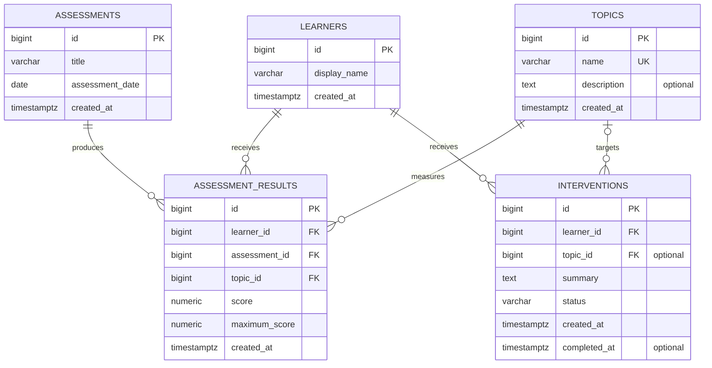

# TutorPulse Entity-Relationship Diagram

This diagram represents the proposed initial TutorPulse database design. It will be reviewed before the PostgreSQL migration is implemented.

## Relationship explanation

### Learners and assessment results

One learner may have zero or many assessment results. Every assessment result must belong to exactly one learner.

### Assessments and assessment results

One assessment may produce zero or many topic-level results. Every assessment result must belong to exactly one assessment.

### Topics and assessment results

One topic may appear in zero or many assessment results. Every assessment result must refer to exactly one topic.

Together, the learner, assessment and topic foreign keys identify what was assessed, who was assessed and which topic the result measures.

### Learners and interventions

One learner may receive zero or many interventions. Every intervention must belong to exactly one learner.

### Topics and interventions

A topic may be associated with zero or many interventions. An intervention may target zero or one topic because some support may be general rather than topic-specific.

## Diagram notation

- `||` means exactly one.
- `o|` means zero or one.
- `o{` means zero or many.
- `PK` identifies a primary key.
- `FK` identifies a foreign key.
- `UK` identifies a unique key.

## Important constraint not fully shown by the diagram

The combination of the following columns in `assessment_results` must be unique:

- `learner_id`
- `assessment_id`
- `topic_id`

This prevents duplicate topic results for the same learner and assessment.
